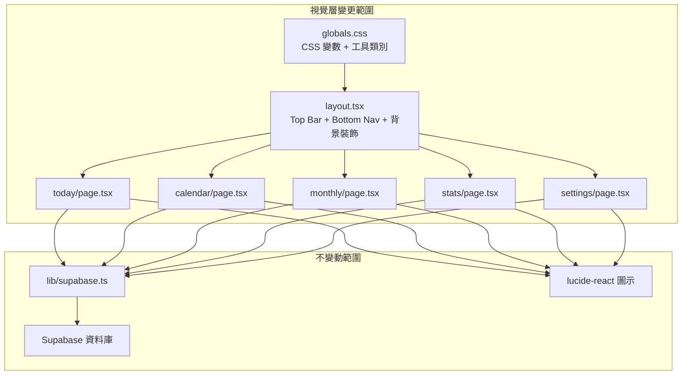
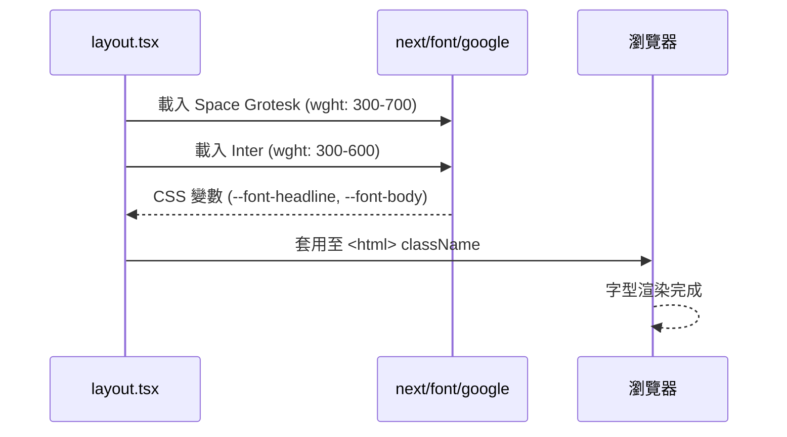
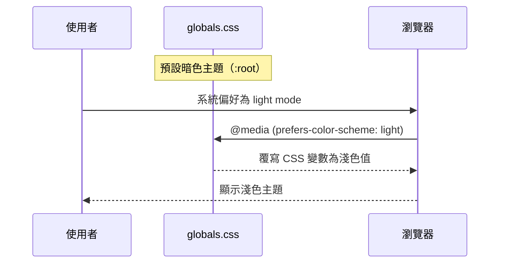
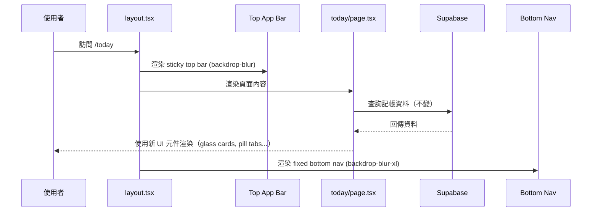

# 設計文件：UI 重新設計（Material Design 3 暗色主題）

## 概述

本專案為一個家庭記帳應用程式，目前使用簡潔的淺色/暗色雙模式 UI。此次重新設計的目標是參考 `code.html` 的視覺風格，將整個應用程式的 UI 升級為以 Material Design 3 為靈感的暗色優先（dark-mode-first）設計語言，同時完整保留所有現有功能（記帳 CRUD、行事曆、月曆總覽、統計圖表、設定）。

核心視覺特徵包括：玻璃擬態卡片（glassmorphism）、動態光暈陰影（kinetic glow）、漸層主色調（cyan/teal primary gradient）、Space Grotesk + Inter 字型組合、pill 形狀的 tab 選擇器與底部導航列，以及裝飾性的模糊背景光圈。

所有 Supabase 資料互動邏輯、lucide-react 圖示庫、Tailwind CSS 4 架構維持不變，僅改變視覺呈現層。

## 架構

### 整體架構不變

應用程式的路由結構、資料流、Supabase 互動層完全不變。此次重新設計僅涉及：

1. **全域樣式層**（`globals.css`）— CSS 變數、字型、工具類別
2. **共用佈局**（`layout.tsx`）— Top App Bar、Bottom Nav、背景裝飾
3. **各頁面元件**（`today/`, `calendar/`, `monthly/`, `stats/`, `settings/`）— 套用新的 Tailwind 類別與色彩系統



## 元件與介面

### 元件 1：設計系統（Design Tokens / CSS 變數）

**用途**：定義整個應用程式的色彩、字型、視覺效果 token，透過 CSS 變數實現主題切換。

**介面**：

```typescript
// 設計 Token 定義（對應 CSS 變數）
interface DesignTokens {
  // 核心色彩
  '--md-background': string;          // #0e131d
  '--md-on-surface': string;          // #dee2f1
  '--md-primary': string;             // #c3f5ff
  '--md-primary-container': string;   // #00e5ff
  '--md-secondary': string;           // #b8c3ff
  '--md-tertiary': string;            // #ffeac0
  '--md-tertiary-container': string;  // #fec931
  '--md-error': string;               // #ffb4ab

  // Surface 層級
  '--md-surface': string;                    // #0e131d
  '--md-surface-container-lowest': string;   // #090e18
  '--md-surface-container-low': string;      // #171c26
  '--md-surface-container': string;          // #1b202a
  '--md-surface-container-high': string;     // #252a35
  '--md-surface-container-highest': string;  // #303540

  // 邊框與輔助
  '--md-outline': string;             // #849396
  '--md-outline-variant': string;     // #3b494c
  '--md-on-surface-variant': string;  // #bac9cc

  // 字型
  '--font-headline': string;  // 'Space Grotesk'
  '--font-body': string;      // 'Inter'
}
```

**職責**：
- 提供暗色主題（預設）與淺色主題的完整色彩對應
- 定義玻璃擬態、光暈陰影等視覺效果的 CSS 工具類別
- 管理字型載入（Space Grotesk + Inter via next/font/google）

### 元件 2：共用佈局（Layout）

**用途**：提供全域的 Top App Bar、Bottom Navigation Bar、背景裝飾元素。

**介面**：

```typescript
// Top App Bar Props
interface TopAppBarProps {
  title?: string;  // 預設 "小管家記帳"
}

// Bottom Nav Item
interface NavItemProps {
  href: string;
  icon: React.ReactNode;       // lucide-react icon
  label: string;               // 繁體中文標籤
  isActive: boolean;
}

// 背景裝飾（固定定位，不影響互動）
interface BackgroundDecorProps {
  // 兩個模糊光圈：primary (左上) + secondary (右下)
}
```

**職責**：
- Sticky Top App Bar：`bg-background/80 backdrop-blur-md`，含 app icon + 標題
- Fixed Bottom Nav：`bg-background/95 backdrop-blur-xl border-t border-outline-variant/10`
- Active nav item 使用 pill 形狀：`px-5 py-1 rounded-full bg-primary/10 text-primary`
- 背景裝飾光圈：`fixed pointer-events-none -z-10`，使用 `blur-[120px]` 的漸層圓形

### 元件 3：玻璃擬態卡片（Glass Card）

**用途**：所有頁面中的卡片容器統一使用玻璃擬態效果。

```typescript
// Glass Card 的 Tailwind 類別組合
const glassCardClasses = `
  bg-[rgba(48,53,64,0.4)]
  backdrop-blur-[20px]
  rounded-2xl
  border border-outline-variant/5
`;

// Kinetic Glow 效果（用於重要卡片）
const kineticGlowClasses = `
  shadow-[0px_20px_40px_rgba(0,218,243,0.08)]
`;
```

### 元件 4：Pill Tab 選擇器

**用途**：取代現有的底線式 tab 切換（日/週/月），改為 pill 形狀。

```typescript
interface PillTabProps {
  options: { key: string; label: string }[];
  activeKey: string;
  onChange: (key: string) => void;
}

// 容器：bg-surface-container-low p-1 rounded-full border border-outline-variant/10
// Active tab：bg-surface-container-highest text-primary rounded-full
// Inactive tab：text-on-surface-variant hover:text-on-surface rounded-full
```

## 資料模型

資料模型完全不變。此次重新設計不涉及任何資料結構的修改。

### 現有資料模型（保持不變）

```typescript
// 記帳資料
type Expense = {
  id: number;
  user_id: string;
  message: string;
  category: string | null;
  note: string;
  amount: number | null;
  time: string;        // YYYY-MM-DD
  intent: string;
  created_at?: string;
};

// 行事曆事件
type CalendarEvent = {
  id: number;
  date: string;        // YYYY-MM-DD
  time: string | null;  // HH:mm
  title: string;
  note: string | null;
  user_id: string;
  is_private: boolean;
  created_at?: string;
};

// 暱稱對應
type UserName = {
  user_id: string;
  display_name: string;
};

// 預算
type Budget = {
  id: number;
  budget: number;
  updated_at: string;
};
```


## 主要演算法/工作流程

### 字型載入流程



### 主題切換流程



### 頁面渲染流程（以 /today 為例）



## 關鍵函式與正式規格

### 函式 1：globals.css — 設計 Token 系統

```css
/* 暗色主題（預設） */
:root {
  --md-background: #0e131d;
  --md-on-surface: #dee2f1;
  --md-primary: #c3f5ff;
  --md-primary-container: #00e5ff;
  --md-secondary: #b8c3ff;
  --md-tertiary: #ffeac0;
  --md-tertiary-container: #fec931;
  --md-error: #ffb4ab;
  --md-surface-container-lowest: #090e18;
  --md-surface-container-low: #171c26;
  --md-surface-container: #1b202a;
  --md-surface-container-high: #252a35;
  --md-surface-container-highest: #303540;
  --md-outline: #849396;
  --md-outline-variant: #3b494c;
  --md-on-surface-variant: #bac9cc;
  --md-on-primary: #00363d;
  --md-on-tertiary: #3e2e00;
  --md-inverse-surface: #dee2f1;
  --md-inverse-on-surface: #2c303b;
}
```

**前置條件：**
- Tailwind CSS 4 已安裝並透過 `@import "tailwindcss"` 載入
- `@theme inline` 區塊正確引用 CSS 變數

**後置條件：**
- 所有 `var(--md-*)` 變數在整個應用程式中可用
- 暗色主題為預設，淺色主題透過 `@media (prefers-color-scheme: light)` 覆寫

### 函式 2：字型載入（layout.tsx）

```typescript
import { Space_Grotesk, Inter } from 'next/font/google';

const spaceGrotesk = Space_Grotesk({
  subsets: ['latin'],
  variable: '--font-headline',
  weight: ['300', '400', '500', '600', '700'],
  display: 'swap',
});

const inter = Inter({
  subsets: ['latin'],
  variable: '--font-body',
  weight: ['300', '400', '500', '600'],
  display: 'swap',
});

// 套用至 <html>
// <html className={`${spaceGrotesk.variable} ${inter.variable}`}>
```

**前置條件：**
- `next/font/google` 可用（Next.js 16 內建）
- 網路可存取 Google Fonts CDN（build time 下載）

**後置條件：**
- `--font-headline` 對應 Space Grotesk
- `--font-body` 對應 Inter
- 字型以 `swap` 策略載入，避免 FOIT

### 函式 3：Bottom Navigation 活躍狀態判斷

```typescript
'use client';

import { usePathname } from 'next/navigation';

function BottomNav() {
  const pathname = usePathname();

  const navItems = [
    { href: '/today', icon: <Home />, label: '記帳' },
    { href: '/calendar', icon: <CalendarDays />, label: '行事曆' },
    { href: '/stats', icon: <BarChart3 />, label: '統計' },
    { href: '/settings', icon: <Settings />, label: '設定' },
  ];

  return (
    <nav className="fixed bottom-0 left-0 right-0 z-50 
                    bg-[var(--md-background)]/95 backdrop-blur-xl 
                    border-t border-[var(--md-outline-variant)]/10 
                    px-4 py-3">
      <div className="max-w-4xl mx-auto flex items-center justify-around">
        {navItems.map(item => {
          const isActive = pathname === item.href 
                        || (item.href === '/today' && pathname === '/monthly');
          return (
            <NavItem key={item.href} {...item} isActive={isActive} />
          );
        })}
      </div>
    </nav>
  );
}
```

**前置條件：**
- `usePathname()` 在 client component 中可用
- 所有 nav items 的 href 對應有效路由

**後置條件：**
- 當前路由對應的 nav item 顯示 pill 形狀的活躍指示器
- `/monthly` 路由歸屬於「記帳」tab

## 演算法虛擬碼

### 演算法 1：CSS 變數主題切換

```pascal
ALGORITHM applyTheme
INPUT: userPreference (系統偏好 light/dark)
OUTPUT: 套用對應的 CSS 變數集

BEGIN
  // 預設：暗色主題
  SET :root variables TO darkThemeTokens

  // 淺色主題覆寫
  IF userPreference = 'light' THEN
    OVERRIDE :root variables WITH lightThemeTokens
    // 淺色主題色彩對應
    SET --md-background TO #f8f9fc
    SET --md-on-surface TO #1b1b1f
    SET --md-primary TO #006875
    SET --md-surface-container TO #eef0f4
    SET --md-outline-variant TO #c4c7c8
    // ... 其餘淺色 token
  END IF
END
```

**前置條件：**
- 瀏覽器支援 CSS 變數與 `prefers-color-scheme` media query

**後置條件：**
- 所有使用 `var(--md-*)` 的元素自動套用正確的主題色彩
- 主題切換不需要 JavaScript 介入

### 演算法 2：玻璃擬態卡片渲染

```pascal
ALGORITHM renderGlassCard(content, hasGlow)
INPUT: content (子元素), hasGlow (是否加光暈)
OUTPUT: 渲染帶有玻璃擬態效果的卡片

BEGIN
  baseStyles ← {
    background: rgba(48, 53, 64, 0.4),
    backdropFilter: blur(20px),
    borderRadius: 1rem,
    border: 1px solid var(--md-outline-variant) at 5% opacity
  }

  IF hasGlow = true THEN
    ADD boxShadow: 0px 20px 40px rgba(0, 218, 243, 0.08)
  END IF

  RENDER <div> WITH baseStyles CONTAINING content
END
```

### 演算法 3：空狀態動畫渲染

```pascal
ALGORITHM renderEmptyState(message, actionLabel, onAction)
INPUT: message (提示文字), actionLabel (按鈕文字), onAction (按鈕回呼)
OUTPUT: 渲染帶有旋轉虛線圓圈動畫的空狀態

BEGIN
  RENDER container WITH glass-card styles, min-height 400px, centered content

  // 裝飾動畫
  RENDER outer circle WITH {
    width: 128px, height: 128px,
    border: 2px dashed, color: primary at 20% opacity,
    animation: spin 12s linear infinite
  }

  RENDER inner diamond WITH {
    width: 64px, height: 64px,
    glass-card background,
    rotate: 45deg,
    kinetic-glow shadow,
    CONTAINING icon rotated -45deg
  }

  // 文字
  RENDER headline WITH font-headline, text-2xl, font-semibold
  RENDER description WITH font-body, text-on-surface-variant, max-w-xs

  // 行動按鈕
  IF actionLabel IS NOT NULL THEN
    RENDER button WITH primary-gradient background, rounded-full, kinetic-glow
  END IF
END
```

## 範例用法

### 範例 1：Glass Card 在記帳頁面的使用

```typescript
// 日期選擇器卡片
<div className="bg-[rgba(48,53,64,0.4)] backdrop-blur-[20px] rounded-xl p-4 
                flex items-center justify-between 
                border-l-2 border-[var(--md-primary)]/30">
  <button className="p-2 hover:bg-[var(--md-surface-container-highest)] rounded-full">
    <ChevronLeft className="w-5 h-5 text-[var(--md-primary)]" />
  </button>
  <h2 className="font-[var(--font-headline)] text-lg font-medium text-[var(--md-on-surface)]">
    {headerDateLabel}
  </h2>
  <button className="p-2 hover:bg-[var(--md-surface-container-highest)] rounded-full">
    <ChevronRight className="w-5 h-5 text-[var(--md-primary)]" />
  </button>
</div>
```

### 範例 2：Pill Tab 選擇器

```typescript
// 日/週/月 切換
<div className="flex bg-[var(--md-surface-container-low)] p-1 rounded-full 
                border border-[var(--md-outline-variant)]/10">
  {(['day', 'week', 'month'] as const).map(m => (
    <button
      key={m}
      onClick={() => setMode(m)}
      className={`px-6 py-2 rounded-full font-[var(--font-body)] text-sm font-medium transition-all
        ${mode === m
          ? 'bg-[var(--md-surface-container-highest)] text-[var(--md-primary)]'
          : 'text-[var(--md-on-surface-variant)] hover:text-[var(--md-on-surface)]'
        }`}
    >
      {m === 'day' ? '日' : m === 'week' ? '週' : '月'}
    </button>
  ))}
</div>
```

### 範例 3：Hero 金額顯示

```typescript
// 總金額 Hero Section
<section className="relative overflow-hidden pt-4">
  <div className="flex flex-col items-start space-y-2">
    <span className="font-[var(--font-body)] text-xs uppercase tracking-widest 
                     text-[var(--md-on-surface-variant)] opacity-70">
      總金額
    </span>
    <div className="flex items-baseline gap-2">
      <span className="font-[var(--font-headline)] text-5xl md:text-7xl font-bold 
                       text-[var(--md-primary)] tracking-tighter"
            style={{ textShadow: '0 0 15px rgba(195, 245, 255, 0.3)' }}>
        $ {integerPart}
      </span>
      <span className="font-[var(--font-headline)] text-2xl font-light 
                       text-[var(--md-primary)] opacity-50">
        .{decimalPart}
      </span>
    </div>
  </div>
  {/* 裝飾光圈 */}
  <div className="absolute -right-20 -top-20 w-64 h-64 
                  bg-gradient-to-br from-[var(--md-primary)] to-[var(--md-primary-container)] 
                  opacity-10 rounded-full blur-[100px]" />
</section>
```

### 範例 4：Bottom Nav Item

```typescript
function NavItem({ href, icon, label, isActive }: NavItemProps) {
  return (
    <Link href={href} className="flex flex-col items-center gap-1 group">
      <div className={`px-5 py-1 rounded-full transition-all
        ${isActive
          ? 'bg-[var(--md-primary)]/10 text-[var(--md-primary)]'
          : 'text-[var(--md-on-surface-variant)] group-hover:bg-[var(--md-surface-container-highest)]'
        }`}>
        <div className="w-5 h-5">{icon}</div>
      </div>
      <span className={`text-[10px] font-medium
        ${isActive ? 'text-[var(--md-primary)]' : 'text-[var(--md-on-surface-variant)]'}`}>
        {label}
      </span>
    </Link>
  );
}
```


## Correctness Properties

*A property is a characteristic or behavior that should hold true across all valid executions of a system — essentially, a formal statement about what the system should do. Properties serve as the bridge between human-readable specifications and machine-verifiable correctness guarantees.*

### Property 1: Functional preservation (CRUD round-trip)

*For any* page (Today, Calendar, Monthly, Stats, Settings) and any CRUD operation (create, read, update, delete), the Supabase query logic must remain identical before and after the UI redesign — the same inputs must produce the same database calls and the same results.

**Validates: Requirements 6.7, 7.6, 8.7, 9.6, 10.6, 11.3, 13.1**

### Property 2: Color system consistency

*For any* rendered page element that uses a color value, the color must reference a `var(--md-*)` CSS variable (or a Tailwind utility class mapped from one), not a hardcoded hex/rgb value (except for rgba opacity values within glass card and glow definitions specified in the design).

**Validates: Requirements 1.1, 1.2, 1.3, 1.4, 1.6**

### Property 3: Navigation active state correctness

*For any* route in the application, exactly one Bottom_Nav item must be in the active state, and the active item must correspond to the current pathname (with `/monthly` mapping to the `/today` nav item).

**Validates: Requirements 3.3, 3.4, 3.5**

### Property 4: Pill tab active/inactive exclusivity

*For any* Pill_Tab component with N options, exactly one tab must be in the active state at any time, and all other N-1 tabs must be in the inactive state with the correct respective styles applied.

**Validates: Requirements 5.2, 5.3, 5.4**

### Property 5: Glass card style uniformity

*For any* content card rendered across all pages (expense cards, event cards, status cards, stats containers), the card must use the glass card class combination (semi-transparent background, backdrop-blur, rounded corners, subtle border).

**Validates: Requirements 4.1, 4.2, 6.4, 7.2**

### Property 6: Content width consistency

*For any* page in the application, the main content container must use `max-w-4xl` as its maximum width constraint.

**Validates: Requirements 6.6, 7.5, 8.6, 9.5, 10.5, 12.1**

### Property 7: Touch target accessibility

*For any* interactive element (button, link, tab) in the application, the element's clickable area must be at least 44x44 CSS pixels.

**Validates: Requirements 12.2, 12.3**

### Property 8: Holiday date styling

*For any* date in the calendar that is marked as a holiday, the date cell must use the error color styles (`bg-error/10 border-error/20`).

**Validates: Requirements 7.4**

## 錯誤處理

### 錯誤場景 1：字型載入失敗

**條件**：Google Fonts CDN 無法存取（離線或網路問題）
**回應**：`next/font` 的 `display: 'swap'` 策略確保使用系統字型作為 fallback
**恢復**：字型在網路恢復後自動載入

### 錯誤場景 2：CSS 變數未定義

**條件**：某個元件引用了不存在的 CSS 變數
**回應**：Tailwind CSS 4 的 `@theme inline` 提供 fallback 值
**恢復**：開發階段透過瀏覽器 DevTools 檢查未定義的變數

### 錯誤場景 3：backdrop-filter 不支援

**條件**：舊版瀏覽器不支援 `backdrop-filter`
**回應**：玻璃擬態效果降級為純色背景（`bg-[var(--md-surface-container-highest)]`）
**恢復**：使用 `@supports (backdrop-filter: blur(20px))` 進行漸進增強

## 測試策略

### 單元測試方法

- 驗證所有 CSS 變數在暗色與淺色主題下都有定義值
- 驗證 `NavItem` 元件在 `isActive=true/false` 時渲染正確的 className
- 驗證所有頁面的 Supabase 查詢邏輯未被修改（snapshot 比對）

### 屬性測試方法

- 對所有頁面進行視覺回歸測試（screenshot comparison）
- 驗證色彩對比度符合 WCAG AA 標準

### 整合測試方法

- 在各頁面執行完整的 CRUD 操作，確認功能不受 UI 變更影響
- 測試底部導航列在所有路由間的切換行為
- 測試 modal（編輯、刪除確認）在新 UI 下的顯示與互動

## 效能考量

- `backdrop-filter: blur()` 在低階裝置上可能造成效能問題，考慮在 `prefers-reduced-motion` 時降級
- 背景裝飾光圈使用 `pointer-events-none` 和 `-z-10` 確保不影響互動效能
- `next/font` 在 build time 下載字型，不會增加 runtime 的網路請求
- 使用 Tailwind CSS 4 的 `@theme inline` 而非 `tailwind.config.ts` 擴展，減少設定檔複雜度

## 安全性考量

- 無新增安全性風險，所有資料互動邏輯不變
- CSS 變數不包含任何敏感資訊

## 依賴項

| 依賴項 | 用途 | 變更類型 |
|--------|------|----------|
| `next/font/google` | 載入 Space Grotesk + Inter 字型 | 新增使用（Next.js 內建） |
| `tailwindcss` ^4 | CSS 框架 | 不變（已安裝） |
| `lucide-react` | 圖示庫 | 不變（已安裝） |
| `@supabase/supabase-js` | 資料庫互動 | 不變（已安裝） |
| `next` 16 | 框架 | 不變（已安裝） |

無需安裝任何新的 npm 套件。所有變更僅涉及 CSS 與 JSX 層面。

---

## 各頁面重新設計規格

### /today（記帳頁面）

| 區域 | 現有設計 | 新設計 |
|------|----------|--------|
| 總金額 | `text-4xl font-bold` | Hero section: `text-5xl md:text-7xl font-headline text-primary text-glow` |
| 月曆按鈕 | 右上角方形按鈕 | 保留，改為 `rounded-full bg-surface-container-highest` |
| 日期切換 | 圓形按鈕 + 文字 | Glass card 容器 + `border-l-2 border-primary/30` |
| 日/週/月 tab | 底線式 | Pill tab: `rounded-full bg-surface-container-low` |
| 排序選單 | `<select>` | 保留 `<select>`，套用新色彩 |
| 記帳卡片 | `border rounded-xl shadow-sm` | Glass card: `bg-[rgba(48,53,64,0.4)] backdrop-blur-[20px] rounded-2xl` |
| 空狀態 | 純文字 | 旋轉虛線圓圈動畫 + glass card 容器 |
| Modal | `bg-card-bg rounded-2xl` | Glass card + `backdrop-blur-sm` overlay |
| 內容寬度 | `max-w-md` | `max-w-4xl` |

### /calendar（行事曆頁面）

| 區域 | 現有設計 | 新設計 |
|------|----------|--------|
| 切換按鈕 | `border rounded-full` | Pill tab 風格 |
| 今日狀態卡 | `border rounded-xl` | Glass card |
| 事件卡片 | `border rounded-2xl shadow-sm` | Glass card + kinetic glow |
| 月曆格子 | `border rounded-lg` | `bg-surface-container rounded-xl` |
| 假日標示 | 紅色背景 | `bg-error/10 border-error/20` |
| 內容寬度 | `max-w-md` | `max-w-4xl` |

### /monthly（月曆總覽頁面）

| 區域 | 現有設計 | 新設計 |
|------|----------|--------|
| 月份切換 | 圓形按鈕 | Glass card 容器 |
| 星期列 | 純文字 | `text-on-surface-variant uppercase tracking-widest` |
| 日期格子 | `border rounded-lg shadow-sm` | `bg-surface-container-high rounded-xl` |
| 今日標示 | `bg-blue-600` | `bg-primary-container text-on-primary` |
| 底部統計 | `border rounded-lg` | Glass card + bento grid 風格 |
| 內容寬度 | `max-w-md` | `max-w-4xl` |

### /stats（統計頁面）

| 區域 | 現有設計 | 新設計 |
|------|----------|--------|
| 圓餅圖容器 | `rounded-2xl shadow-sm` | Glass card + kinetic glow |
| 分類列表 | `border rounded-xl shadow-sm` | Glass card |
| 進度條 | `bg-input-bg` | `bg-surface-container-low` |
| 趨勢圖 Modal | `rounded-t-3xl` | Glass card + `backdrop-blur-sm` |
| 內容寬度 | `max-w-md` | `max-w-4xl` |

### /settings（設定頁面）

| 區域 | 現有設計 | 新設計 |
|------|----------|--------|
| 標題 | `text-lg font-semibold` | `font-headline text-xl tracking-tight` |
| 表單輸入 | `border rounded` | `bg-surface-container border-outline-variant/10 rounded-xl` |
| 儲存按鈕 | `bg-blue-600 rounded-md` | `primary-gradient rounded-full kinetic-glow` |
| 列表項目 | `border-b` | `bg-surface-container-high rounded-xl p-4` |
| 內容寬度 | `max-w-md` | `max-w-4xl` |
